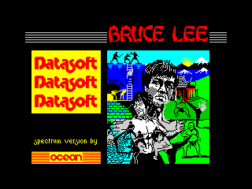

# Поддержка файлов игр формата Z80/TAP/TZX в качестве аттача

Если игра содержит загрузочный экран (можно определить по наличию блока в 6912 байт), то на превьюшке рисуем его, если нам дали дамп памяти в виде Z80, то рисуем просто содержимое экрана. По клику - картинка не просто разворачивается, но и запускается виртуальная машина ZX-Spectrum вс этим файлом и игра оживает.

В принципе, можно добавить поддержку форматов AY или даже SID как музыкальных. Само собой можно подумать и о музыке с других платформ, т.е. популярные форматы mod / s3m / xm / it / hvl.

