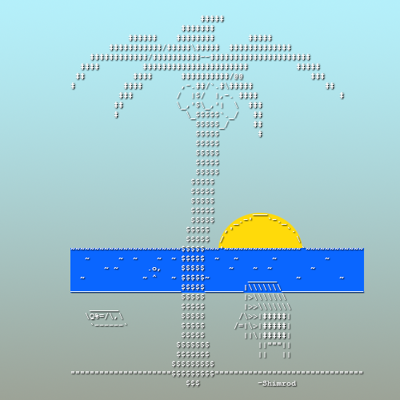

# Минимализм и SVG (или другой векторный формат картинок)

Обычно хочется иметь больше возможностей, чем меньше... Но иногда ограничения могут подстегнуть креативную мысль и родить что-то необычное там, где вроде бы ничего быть не может.

Идея: сделать доску, где можно постить только картинки в формате SVG, причем с ограничением в 5кб на картинку!

Надо сказать, что это попытка нарисовать векторную картинку из аски-арта, а это настоящий SVG, потому что рисовать я не умею.

Вполне возможно, что это настолько жестокое ограничение, что даже сверх-креативный Анон нихуя не будет рисовать в таких жестких условиях.
