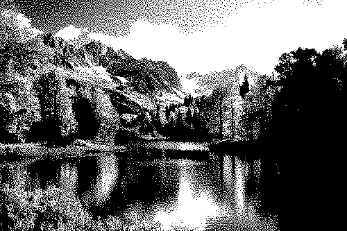
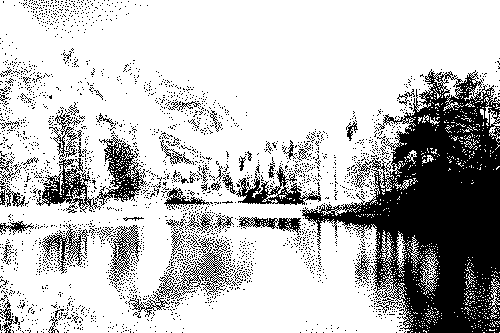

# Минимализм и WBMP

Обычно хочется иметь больше возможностей, чем меньше... Но иногда ограничения могут подстегнуть креативную мысль и родить что-то необычное там, где вроде бы ничего быть не может.

Идея: сделать доску, где можно постить только картинки в формате WBMP или похожие на них (об этом ниже). Отличительной особенностью WBMP является то, что это черно-белые картинки с глубиной яркости в 1 бит. Выглядят они примерно вот так:

Обратите внимание на засвет в небе и черноту в правой части изображения - это последствия автоматического конвертирования. Можно попробовать немного задрать уровни яркости и картинка изменит свой вид:

Отражения на воде стали божественными, а островок справа - стал различимым. Но к сожалению, оставшаяся часть картинки пострадала больше, чем получила деталей. Автоматическое конвертирование все еще не смогло справиться с задачей.

Но значит ли это, что справиться с задачей вообще невозможно? Я считаю, что если немного потратить своего времени, поиграть кисточками в фотошопе, то вполне себе можно будет сделать хорошую РУЧНУЮ конверсию! А там, где надо подчеркнуть какие-то детали, вполне можно сделать обводку по пикселям, спустившись до уровня пиксель-арта!

Пиксель-арт - это искусство из ограничений!

Возможно, имеет смысл не только постить статические изображения, но можно позволить постить картинки с альфа-каналом или даже анимации:

Я считаю, что ограничение на постинг 1-битных картинок - отличный стимул для Анона, чтобы раскрыть свой креатив и проявить свои творческие способности!
